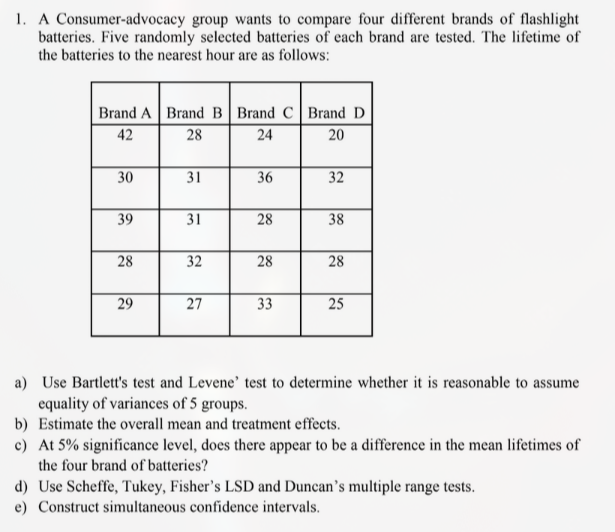

# Assignment 1: Question 1



## Summary 

1. Both Bartlett's test and Levene's test results have $p > 0.05$ and thus we do not reject the assumption of equal variances
1. The overall mean lifetime is $30.45$ hours. The difference of each brand from the mean can be seen in the outputs below
1. At the $5$% significance level the ANOVA test shows no difference between the mean lifetimes of the four brands
1. Scheffe, Tuket, Fisher's LSD, and Duncan's multiple range tests all agree with the result of ANOVA
1. The simultaneous confidence intervals for the differencces in mean lifetime between pairs of brands all include $0$, based on Tukey's method. 

## R output

```text
=== Bartlett's Test (equal variance assumption) ===

	Bartlett test of homogeneity of variances

data:  lifetime by brand
Bartlett's K-squared = 4.4202, df = 3, p-value = 0.2195

=== Levene's Test ===
Levene's Test for Homogeneity of Variance (center = median)
      Df F value Pr(>F)
group  3   0.825 0.4992
      16

=== Overall Mean ===
[1] 30.45

=== Brand Means & Treatment Effects ===
  brand lifetime effect
1     A     33.6   3.15
2     B     29.8  -0.65
3     C     29.8  -0.65
4     D     28.6  -1.85

=== ANOVA Results ===
            Df Sum Sq Mean Sq F value Pr(>F)
brand        3     71   23.65   0.823    0.5
Residuals   16    460   28.75

=== Tukey's HSD ===
  Tukey multiple comparisons of means
    95% family-wise confidence level

Fit: aov(formula = lifetime ~ brand, data = battery_data)

$brand
    diff       lwr     upr     p adj
B-A -3.8 -13.50219 5.90219 0.6825825
C-A -3.8 -13.50219 5.90219 0.6825825
D-A -5.0 -14.70219 4.70219 0.4745970
C-B  0.0  -9.70219 9.70219 1.0000000
D-B -1.2 -10.90219 8.50219 0.9842470
D-C -1.2 -10.90219 8.50219 0.9842470

=== Scheffe's Test ===

  Posthoc multiple comparisons of means: Scheffe Test
    95% family-wise confidence level

$brand
    diff    lwr.ci    upr.ci   pval
B-A -3.8 -14.37076  6.770765 0.7421
C-A -3.8 -14.37076  6.770765 0.7421
D-A -5.0 -15.57076  5.570765 0.5520
C-B  0.0 -10.57076 10.570765 1.0000
D-B -1.2 -11.77076  9.370765 0.9882
D-C -1.2 -11.77076  9.370765 0.9882

---
Signif. codes:  0 '***' 0.001 '**' 0.01 '*' 0.05 '.' 0.1 ' ' 1


=== Fisher's LSD Test ===

	Pairwise comparisons using t tests with pooled SD

data:  battery_data$lifetime and battery_data$brand

  A    B    C
B 0.28 -    -
C 0.28 1.00 -
D 0.16 0.73 0.73

P value adjustment method: none
Loading required package: agricolae

=== Duncan's Multiple Range Test ===
$statistics
  MSerror Df  Mean       CV
    28.75 16 30.45 17.60888

$parameters
    test name.t ntr alpha
  Duncan  brand   4  0.05

$duncan
     Table CriticalRange
2 2.997999      7.188948
3 3.143802      7.538573
4 3.234945      7.757125

$means
  lifetime      std r       se Min Max Q25 Q50 Q75
A     33.6 6.426508 5 2.397916  28  42  29  30  39
B     29.8 2.167948 5 2.397916  27  32  28  31  31
C     29.8 4.711688 5 2.397916  24  36  28  28  33
D     28.6 6.841053 5 2.397916  20  38  25  28  32

$comparison
NULL

$groups
  lifetime groups
A     33.6      a
B     29.8      a
C     29.8      a
D     28.6      a

attr(,"class")
[1] "group"

=== Tukey Simultaneous Confidence Intervals ===
  Tukey multiple comparisons of means
    95% family-wise confidence level

Fit: aov(formula = lifetime ~ brand, data = battery_data)

$brand
    diff       lwr     upr     p adj
B-A -3.8 -13.50219 5.90219 0.6825825
C-A -3.8 -13.50219 5.90219 0.6825825
D-A -5.0 -14.70219 4.70219 0.4745970
C-B  0.0  -9.70219 9.70219 1.0000000
D-B -1.2 -10.90219 8.50219 0.9842470
D-C -1.2 -10.90219 8.50219 0.9842470
```

## Python Output

```text
=== Bartlett's Test ===
Statistic: 6.039, p-value: 0.110

=== Levene's Test ===
Statistic: 0.825, p-value: 0.499

=== Overall Mean ===
Overall mean: 30.45

=== Brand Means & Treatment Effects ===
  brand  lifetime  treatment_effect
0     A      33.6              3.15
1     B      29.8             -0.65
2     C      29.8             -0.65
3     D      28.6             -1.85

=== ANOVA Results ===
F-statistic: 0.823, p-value: 0.500
          sum_sq    df         F    PR(>F)
brand      70.95   3.0  0.822609  0.500349
Residual  460.00  16.0       NaN       NaN

=== Tukey's HSD ===
Multiple Comparison of Means - Tukey HSD, FWER=0.05
====================================================
group1 group2 meandiff p-adj   lower   upper  reject
----------------------------------------------------
     A      B     -3.8 0.6826 -13.5022 5.9022  False
     A      C     -3.8 0.6826 -13.5022 5.9022  False
     A      D     -5.0 0.4746 -14.7022 4.7022  False
     B      C      0.0    1.0  -9.7022 9.7022  False
     B      D     -1.2 0.9842 -10.9022 8.5022  False
     C      D     -1.2 0.9842 -10.9022 8.5022  False
----------------------------------------------------

=== Fisher's LSD ===
A vs B p-value: 0.246
A vs C p-value: 0.317
A vs D p-value: 0.268
B vs C p-value: 1.000
B vs D p-value: 0.718
C vs D p-value: 0.755

=== Tukey Confidence Intervals ===
Diff: -3.80 CI: (-13.50, 5.90)
Diff: -3.80 CI: (-13.50, 5.90)
Diff: -5.00 CI: (-14.70, 4.70)
Diff: 0.00 CI: (-9.70, 9.70)
Diff: -1.20 CI: (-10.90, 8.50)
Diff: -1.20 CI: (-10.90, 8.50)
```
