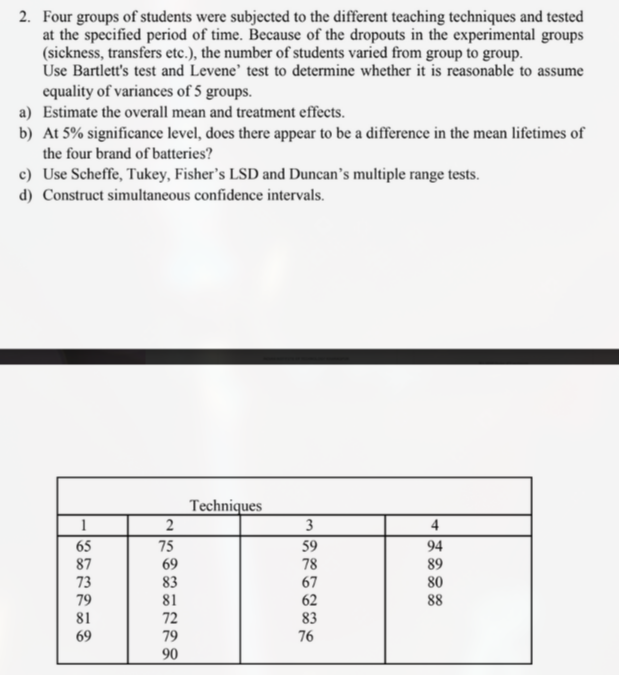

# Assignment 1: Question 2



## Summary 

1. Both Bartlett's test and Levene's test results have $p > 0.05$ and thus we do not reject the assumption of equal variances
1. The overall mean is $77.35$ marks. The difference of each technique from the mean can be seen in the outputs below
1. At the $5$% significance level the ANOVA test has $p = 0.028 < 0.05$ and thus there is a significant difference in the results of the techniques
1. Scheffe, Tuket, Fisher's LSD, and Duncan's multiple range tests show that T4 scores higher than T3
1. The simultaneous confidence intervals show only the T4 - T3 interval excludes $0$, confirming T4 siginificantly outperforms T3

## R output

```text
=== Bartlett's Test (equal variance assumption) ===

	Bartlett test of homogeneity of variances

data:  scores by technique
Bartlett's K-squared = 0.94217, df = 3, p-value = 0.8152


=== Levene's Test ===
Levene's Test for Homogeneity of Variance (center = median)
      Df F value Pr(>F)
group  3  1.2125 0.3323
      19

=== Overall Mean ===
[1] 77.34783

=== technique Means & Treatment Effects ===
  technique   scores    effect
1        T1 75.66667 -1.681159
2        T2 78.42857  1.080745
3        T3 70.83333 -6.514493
4        T4 87.75000 10.402174

=== ANOVA Results ===
            Df Sum Sq Mean Sq F value Pr(>F)
technique    3  712.6  237.53   3.771  0.028 *
Residuals   19 1196.6   62.98
---
Signif. codes:  0 ‘***’ 0.001 ‘**’ 0.01 ‘*’ 0.05 ‘.’ 0.1 ‘ ’ 1

=== Tukey's HSD ===
  Tukey multiple comparisons of means
    95% family-wise confidence level

Fit: aov(formula = scores ~ technique, data = battery_data)

$technique
           diff        lwr       upr     p adj
T2-T1  2.761905  -9.652957 15.176766 0.9225816
T3-T1 -4.833333 -17.716844  8.050177 0.7200708
T4-T1 12.083333  -2.320870 26.487536 0.1197999
T3-T2 -7.595238 -20.010100  4.819623 0.3410918
T4-T2  9.321429  -4.665172 23.308029 0.2718203
T4-T3 16.916667   2.512464 31.320870 0.0179873


=== Scheffe's Test ===

  Posthoc multiple comparisons of means: Scheffe Test
    95% family-wise confidence level

$technique
           diff     lwr.ci    upr.ci   pval
T2-T1  2.761905 -10.761910 16.285720 0.9408
T3-T1 -4.833333 -18.867659  9.200993 0.7749
T4-T1 12.083333  -3.607520 27.774187 0.1716
T3-T2 -7.595238 -21.119053  5.928577 0.4202
T4-T2  9.321429  -5.914521 24.557378 0.3471
T4-T3 16.916667   1.225813 32.607520 0.0316 *

---
Signif. codes:  0 '***' 0.001 '**' 0.01 '*' 0.05 '.' 0.1 ' ' 1


=== Fisher's LSD Test ===

	Pairwise comparisons using t tests with pooled SD

data:  battery_data$scores and battery_data$technique

   T1     T2     T3
T2 0.5391 -      -
T3 0.3047 0.1016 -
T4 0.0292 0.0764 0.0037

P value adjustment method: none

=== Duncan's Multiple Range Test ===
$statistics
   MSerror Df     Mean       CV
  62.98058 19 77.34783 10.26019

$parameters
    test    name.t ntr alpha
  Duncan technique   4  0.05

$duncan
NULL

$means
     scores      std r       se Min Max   Q25  Q50   Q75
T1 75.66667 8.164966 6 3.239871  65  87 70.00 76.0 80.50
T2 78.42857 7.114706 7 2.999537  69  90 73.50 79.0 82.00
T3 70.83333 9.579492 6 3.239871  59  83 63.25 71.5 77.50
T4 87.75000 5.795113 4 3.968015  80  94 86.00 88.5 90.25

$comparison
NULL

$groups
     scores groups
T4 87.75000      a
T2 78.42857     ab
T1 75.66667      b
T3 70.83333      b

attr(,"class")
[1] "group"

=== Tukey Simultaneous Confidence Intervals ===
  Tukey multiple comparisons of means
    95% family-wise confidence level

Fit: aov(formula = scores ~ technique, data = battery_data)

$technique
           diff        lwr       upr     p adj
T2-T1  2.761905  -9.652957 15.176766 0.9225816
T3-T1 -4.833333 -17.716844  8.050177 0.7200708
T4-T1 12.083333  -2.320870 26.487536 0.1197999
T3-T2 -7.595238 -20.010100  4.819623 0.3410918
T4-T2  9.321429  -4.665172 23.308029 0.2718203
T4-T3 16.916667   2.512464 31.320870 0.0179873
```

## Python Output

```text
=== Bartlett's Test ===
Statistic: 3.356, p-value: 0.340

=== Levene's Test ===
Statistic: 1.213, p-value: 0.332

=== Overall Mean ===
Overall mean: 77.35

=== technique Means & Treatment Effects ===
  technique     scores  treatment_effect
0        T1  75.666667         -1.681159
1        T2  78.428571          1.080745
2        T3  70.833333         -6.514493
3        T4  87.750000         10.402174

=== ANOVA Results ===
F-statistic: 3.771, p-value: 0.028
                sum_sq    df         F    PR(>F)
technique   712.586439   3.0  3.771461  0.028041
Residual   1196.630952  19.0       NaN       NaN

=== Tukey's HSD ===
 Multiple Comparison of Means - Tukey HSD, FWER=0.05
=====================================================
group1 group2 meandiff p-adj   lower    upper  reject
-----------------------------------------------------
    T1     T2   2.7619 0.9226   -9.653 15.1768  False
    T1     T3  -4.8333 0.7201 -17.7168  8.0502  False
    T1     T4  12.0833 0.1198  -2.3209 26.4875  False
    T2     T3  -7.5952 0.3411 -20.0101  4.8196  False
    T2     T4   9.3214 0.2718  -4.6652  23.308  False
    T3     T4  16.9167  0.018   2.5125 31.3209   True
-----------------------------------------------------

=== Fisher's LSD ===
T1 vs T2 p-value: 0.528
T1 vs T3 p-value: 0.369
T1 vs T4 p-value: 0.035
T2 vs T3 p-value: 0.129
T2 vs T4 p-value: 0.054
T3 vs T4 p-value: 0.014

=== Tukey Confidence Intervals ===
Diff: 2.76 CI: (-9.65, 15.18)
Diff: -4.83 CI: (-17.72, 8.05)
Diff: 12.08 CI: (-2.32, 26.49)
Diff: -7.60 CI: (-20.01, 4.82)
Diff: 9.32 CI: (-4.67, 23.31)
Diff: 16.92 CI: (2.51, 31.32)
```
