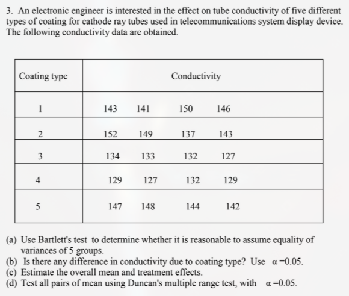

# Assignment 1: Question 3



## Summary 

1. Both Bartlett's test and Levene's test results have $p > 0.05$ and thus we do not reject the assumption of equal variances
1. The overall mean is $139.25$. The difference of each coating from the mean can be seen in the outputs below
1. At the $5$% significance level the ANOVA test has $p = 0.000024 < 0.05$ and thus there is a significant difference in the results of the coatings
1. Duncan's multiple range test show that C1, C2, C5 have higher conductivity and C3, C4 have lower conductivity
1. The simultaneous comparison from Duncan’s grouping shows that any coating in group a (C1, C2, C5) has significantly higher mean conductivity than any coating in group b (C3, C4).

## R output

```text
=== Bartlett's Test (equal variance assumption) ===

	Bartlett test of homogeneity of variances

data:  conductivity by coating
Bartlett's K-squared = 4.4173, df = 4, p-value = 0.3525


=== Levene's Test ===
Levene's Test for Homogeneity of Variance (center = median)
      Df F value Pr(>F)
group  4   2.259 0.1112
      15

=== Overall Mean ===
[1] 139.25

=== coating Means & Treatment Effects ===
  coating conductivity effect
1      C1       145.00   5.75
2      C2       145.25   6.00
3      C3       131.50  -7.75
4      C4       129.25 -10.00
5      C5       145.25   6.00

=== ANOVA Results ===
            Df Sum Sq Mean Sq F value   Pr(>F)
coating      4 1060.5  265.13   16.35 2.41e-05 ***
Residuals   15  243.3   16.22
---
Signif. codes:  0 ‘***’ 0.001 ‘**’ 0.01 ‘*’ 0.05 ‘.’ 0.1 ‘ ’ 1

=== Duncan's Multiple Range Test ===
$statistics
   MSerror Df   Mean       CV
  16.21667 15 139.25 2.891915

$parameters
    test  name.t ntr alpha
  Duncan coating   5  0.05

$duncan
     Table CriticalRange
2 3.014325      6.069331
3 3.159826      6.362298
4 3.250248      6.544362
5 3.311848      6.668393

$means
   conductivity      std r       se Min Max    Q25   Q50    Q75
C1       145.00 3.915780 4 2.013496 141 150 142.50 144.5 147.00
C2       145.25 6.652067 4 2.013496 137 152 141.50 146.0 149.75
C3       131.50 3.109126 4 2.013496 127 134 130.75 132.5 133.25
C4       129.25 2.061553 4 2.013496 127 132 128.50 129.0 129.75
C5       145.25 2.753785 4 2.013496 142 148 143.50 145.5 147.25

$comparison
NULL

$groups
   conductivity groups
C2       145.25      a
C5       145.25      a
C1       145.00      a
C3       131.50      b
C4       129.25      b
```

## Python Output

```text

=== Bartlett's Test ===
Statistic: 5.869, p-value: 0.209

=== Levene's Test ===
Statistic: 2.259, p-value: 0.111

=== Overall Mean ===
Overall mean: 139.25

=== coating Means & Treatment Effects ===
  coating  conductivity  treatment_effect
0      C1        145.00              5.75
1      C2        145.25              6.00
2      C3        131.50             -7.75
3      C4        129.25            -10.00
4      C5        145.25              6.00

=== ANOVA Results ===
F-statistic: 16.349, p-value: 0.000
           sum_sq    df          F    PR(>F)
coating   1060.50   4.0  16.348921  0.000024
Residual   243.25  15.0        NaN       NaN

=== Tukey's HSD ===
 Multiple Comparison of Means - Tukey HSD, FWER=0.05 
=====================================================
group1 group2 meandiff p-adj   lower    upper  reject
-----------------------------------------------------
    C1     C2     0.25    1.0  -8.5429  9.0429  False
    C1     C3    -13.5 0.0021 -22.2929 -4.7071   True
    C1     C4   -15.75 0.0005 -24.5429 -6.9571   True
    C1     C5     0.25    1.0  -8.5429  9.0429  False
    C2     C3   -13.75 0.0018 -22.5429 -4.9571   True
    C2     C4    -16.0 0.0004 -24.7929 -7.2071   True
    C2     C5      0.0    1.0  -8.7929  8.7929  False
    C3     C4    -2.25 0.9295 -11.0429  6.5429  False
    C3     C5    13.75 0.0018   4.9571 22.5429   True
    C4     C5     16.0 0.0004   7.2071 24.7929   True
-----------------------------------------------------

=== Fisher's LSD ===
C1 vs C2 p-value: 0.950
C1 vs C3 p-value: 0.002
C1 vs C4 p-value: 0.000
C1 vs C5 p-value: 0.920
C2 vs C3 p-value: 0.010
C2 vs C4 p-value: 0.004
C2 vs C5 p-value: 1.000
C3 vs C4 p-value: 0.273
C3 vs C5 p-value: 0.001
C4 vs C5 p-value: 0.000

=== Tukey Confidence Intervals ===
Diff: 0.25 CI: (-8.54, 9.04)
Diff: -13.50 CI: (-22.29, -4.71)
Diff: -15.75 CI: (-24.54, -6.96)
Diff: 0.25 CI: (-8.54, 9.04)
Diff: -13.75 CI: (-22.54, -4.96)
Diff: -16.00 CI: (-24.79, -7.21)
Diff: 0.00 CI: (-8.79, 8.79)
Diff: -2.25 CI: (-11.04, 6.54)
Diff: 13.75 CI: (4.96, 22.54)
Diff: 16.00 CI: (7.21, 24.79)
```
